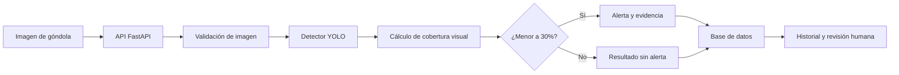

# Detección de disponibilidad visual en góndolas

Proyecto de título APT orientado a detectar condiciones de baja disponibilidad visual en góndolas de supermercado mediante visión computacional.

La solución analiza una imagen de la góndola, estima la ocupación visual de sus zonas y genera una alerta cuando el resultado es menor al umbral configurado. Para el MVP, el umbral inicial es **30 % de disponibilidad visual**.

> El proyecto no busca calcular inventario físico exacto ni identificar obligatoriamente cada SKU. Su propósito es entregar una señal visual, trazable y revisable para priorizar la inspección o reposición.

## Problema

La supervisión de góndolas se realiza habitualmente mediante recorridos manuales. Esto puede generar detecciones tardías de espacios con pocos productos visibles y resultados que dependen de la observación de cada persona.

Una fotografía contiene evidencia útil, pero requiere un proceso consistente para convertirla en una decisión operativa. El proyecto propone ese flujo: imagen, análisis, cálculo de disponibilidad visual, alerta y evidencia para revisión humana.

## Objetivo

Desarrollar una plataforma web que estime la disponibilidad visual de productos en góndolas a partir de imágenes, genere alertas bajo un umbral configurable y conserve evidencia de cada análisis.

## Alcance del MVP

- Carga manual de imágenes de góndolas en formatos JPG o PNG.
- Validación de calidad y formato de la imagen de entrada.
- Detección de productos visibles con una línea base basada en YOLO.
- Cálculo de cobertura o disponibilidad visual por zona de góndola.
- Alerta cuando la disponibilidad visual sea menor al 30 %.
- Historial de análisis, umbral aplicado y evidencia de imagen.
- API, plataforma web y servicios ejecutables mediante Docker.

### Fuera de alcance inicial

- Inventario físico exacto o integración con sistemas internos de stock.
- Reconocimiento obligatorio de SKU, marca o producto individual.
- Cámara en vivo integrada a producción.
- Reposición automática sin validación humana.
- Reentrenamiento autónomo del modelo en producción.

## Arquitectura propuesta



## Tecnologías consideradas

| Componente | Propuesta | Propósito |
|---|---|---|
| Visión computacional | YOLO, OpenCV y NumPy | Detectar productos y estimar cobertura visual. |
| Backend | Python y FastAPI | Exponer el análisis mediante una API. |
| Persistencia | Base de datos relacional | Guardar usuarios, análisis, alertas y configuración. |
| Interfaz | Aplicación web | Cargar imágenes, revisar resultados y consultar historial. |
| Despliegue | Docker | Ejecutar el sistema de forma reproducible. |

## Datos y estado actual

El dataset de trabajo recibido contenía 60 imágenes. Tras eliminar un duplicado, se estandarizaron **59 imágenes únicas**. Las anotaciones disponibles son cajas delimitadoras de detección, por lo que permiten construir una línea base de YOLO.

El proyecto se encuentra en la etapa inicial de Fase 1: definición de alcance, requisitos, diseño, normalización de datos y preparación del experimento. Aún no se deben interpretar los mockups como una integración productiva del modelo ni se declaran métricas antes de entrenar y evaluar.

## Entregables de Fase 1

Los entregables requeridos por la asignatura se encuentran bajo la ruta exacta que será revisada automáticamente:

```text
002D/
└── Equipo XX/
    └── Fase 1/
        ├── Evidencias Individuales/
        └── Evidencias Grupales/
```

Incluye evidencias individuales, evaluación formativa, guía de definición del proyecto, planilla de evaluación y `Presentación Proyecto.pptx` con el nombre solicitado.

## Próximo hito

Entrenar y evaluar la línea base de detección con el dataset estandarizado. La evaluación determinará si el modelo permite sustentar el indicador de disponibilidad visual o si se requiere ampliar el conjunto de datos y sus etiquetas.

## Principios del proyecto

- La alerta es una ayuda para la revisión humana, no una decisión autónoma de reposición.
- Cada análisis debe ser trazable a su imagen, umbral aplicado, fecha y versión del modelo.
- Las mejoras del dataset deben versionarse y validarse antes de incorporarse al entrenamiento.
- No se publican datos sensibles ni información comercial del cliente.
